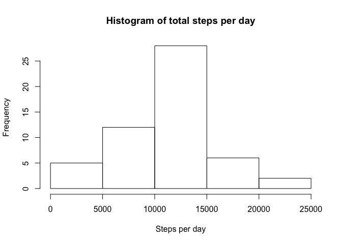
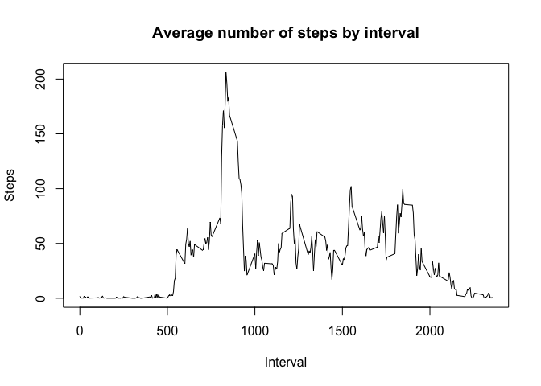
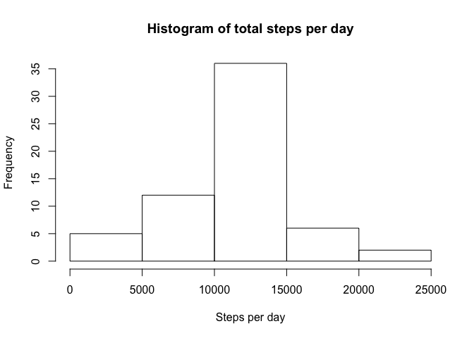

# Reproducible Research: Peer Assessment 1


## Loading and preprocessing the data

```r
library(ggplot2);
library(plyr);
#Read activity file
activity <- read.csv("./activity.csv");activity <- read.csv("./activity.csv");
#Activity_withoutNA has no NA records
activity_withoutNA <- na.omit(activity,cols=("steps"));
```
  
## What is mean total number of steps taken per day?  
  

```r
dsteps <- ddply(activity_withoutNA, .(date), summarize, steps=sum(steps));
hist(dsteps$steps,main="Histogram of total steps per day",xlab="Steps per day");
```

 

```r
mean <- format(mean(dsteps$steps),digit=7);
median <- median(dsteps$steps);
```

  
The mean when ignoring NA records is 10766.19  
The median when ignoring NA records  is 10765
  
## What is the average daily activity pattern?

```r
#Summarize data
isteps <- ddply(activity_withoutNA, .(interval), summarize, msteps=mean(steps,na.rm=TRUE));
#Plot time series
plot(isteps$interval,isteps$msteps,type="l",xlab="Interval",ylab="Steps",main="Steps by interval");
```

 

```r
#Interval with the max avg steps across all days
minterval <- isteps[isteps$msteps == max(isteps$msteps,na.rm=TRUE),];
```

The maximum interval is `r minterval'.

## Imputing missing values

```r
# Count of NA values
nrow(activity[is.na(activity$steps),]);
```

```
## [1] 2304
```

```r
#Fill NA by merging with isteps (average steps by interval)
activity_backfill <- merge(activity,isteps);

activity_backfill[is.na(activity_backfill$step),]$steps <- activity_backfill[is.na(activity_backfill$step),]$msteps; 

activity_backfill$msteps <- NULL;

#Create histogram of daily steps
dsteps_backfill <- ddply(activity_backfill, .(date), summarize, steps=sum(steps));
hist(dsteps_backfill$steps,main="Histogram of total steps per day",xlab="Steps per day");
```

 

```r
mean_backfill <- format(mean(dsteps_backfill$steps),digit=7);
median_backfill <- format(median(dsteps_backfill$steps),digit=7);
```
      

The mean when ignoring NA records is 10766.19  
The median when ignoring NA records  is 10765  

The mean with backfill of NA data is 10766.19  
The median with backfill of NA data  is 10766.19  
  
After backfill, the mean stays the same and the median increases slightly.
  
## Are there differences in activity patterns between weekdays and weekends?
